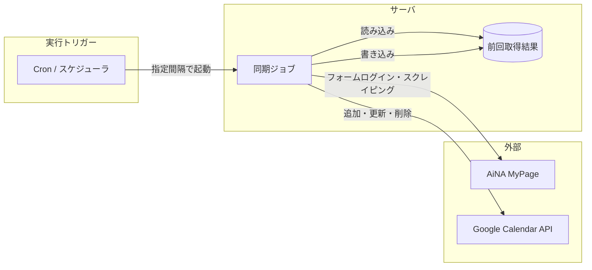
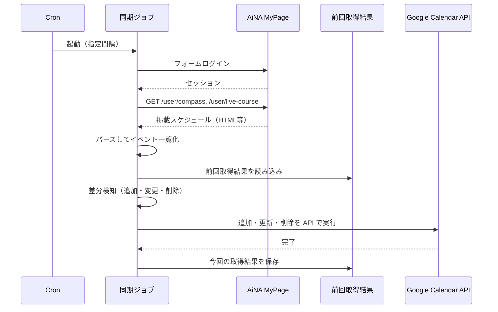

# 基本設計書

**ベース**: [docs/02_要件定義書.md](02_要件定義書.md) で決まった機能を、**どのような構成で実現するか**に落とし込んだ文書です。

---

## 1. システム構成

### 1.1 構成図

本システムは**利用者がブラウザで操作する Web アプリではなく**、**サーバ上で定期実行されるバッチ（同期ジョブ）**です。

| 要素 | 説明 |
|------|------|
| Cron / スケジューラ | 指定間隔（例：1時間毎・5分毎・毎日）で同期ジョブを起動する。Vercel Cron・AWS EventBridge・cron 等を想定。 |
| 同期ジョブ | AiNA MyPage へのログイン・2URL（compass / live-course）からの取得、前回結果との比較、Google カレンダーへの反映を行う。 |
| 前回取得結果 | 差分検知のため、前回取得した掲載スケジュールを保存する。DB またはファイルストア。 |
| AiNA MyPage | 参照元。ログイン URL: https://mypage.ai-na.co.jp/login。取得 URL: /user/compass, /user/live-course。 |
| Google Calendar API | 登録先。検知した追加・変更・削除をイベントとして反映する。 |

### 1.2 利用環境

| 項目 | 内容 |
|------|------|
| 利用者端末 | PC のみ（要件定義どおり）。本システムは**画面を持たず**、利用者は Google カレンダーで結果を確認する。 |
| サーバ・ホスティング | 定期実行が可能な環境（Vercel Cron、常時稼働サーバ、FaaS 等）。要確認：実行時間制限・ネットワーク制限。 |
| 外部連携 | AiNA MyPage（フォームログイン・HTTP）、Google Calendar API。 |

---

## 2. 画面・API 一覧

### 2.1 画面

**本システムは利用者向けの画面を持たない。** 設定変更は環境変数（.env）または設定ファイルで行う。任意機能（W1）で「間隔の簡単な変更」を実現する場合は、設定ファイル（例：config.json）や簡易管理画面を検討する。

| 種別 | 内容 |
|------|------|
| 利用者向け画面 | なし。スケジュールの閲覧は **Google カレンダー** で行う。 |
| 設定 | 環境変数（.env）必須。任意で設定ファイル・簡易UI。 |

### 2.2 ジョブ・処理単位

| 処理ID | 処理名 | 概要 | 起動契機 |
|--------|--------|------|----------|
| JOB-01 | 掲載スケジュール取得 | AiNA MyPage にログインし、compass / live-course の2URLからイベント一覧を取得する | 同期ジョブの第1ステップ |
| JOB-02 | 差分検知 | 取得結果と保存済み「前回取得結果」を比較し、追加・変更・削除を検知する | 取得後の第2ステップ |
| JOB-03 | Google カレンダー反映 | 検知した追加・変更・削除を Google Calendar API で反映する。前回取得結果を今回の結果で上書き保存する | 差分検知後の第3ステップ |
| 同期ジョブ全体 | 上記 JOB-01 → JOB-02 → JOB-03 を順に実行 | Cron 等で指定間隔ごとに起動 |

---

## 3. データの流れ（同期 1 回分）

- **初回**: 前回取得結果がないため「全件を追加」として Google カレンダーに登録し、今回の取得結果を保存する。
- **2回目以降**: 前回取得結果と比較し、差分だけを Google カレンダーに反映（パッチ形式）。

---

## 4. 主要なデータ

| データ名 | 説明 | 主な項目（例） | 保存場所 |
|----------|------|----------------|----------|
| 掲載スケジュール（取得結果） | AiNA MyPage から取得したイベント一覧 | イベントID、タイトル、日時、URL、満員フラグ、取得元（compass/live-course）。**live-course のみ**：場所、講師、備考（説明文＝講師+備考でカレンダー登録）。compass は場所・説明文不要。 | 前回分はストアに保存。今回分は処理後に上書き保存。 |
| 前回取得結果 | 差分検知用のスナップショット | 上記と同じ構造をシリアライズして保存 | DB またはファイル（要確認） |
| Google カレンダー イベント | 登録先の 1 件 | カレンダーID、イベントID、タイトル、開始・終了日時、説明等 | Google カレンダー（API 経由） |

※ 掲載スケジュールの項目・型・「満員」の扱いは詳細設計書で定義する。

---

## 5. 設定項目（環境変数想定）

| 変数名（例） | 説明 | 備考 |
|--------------|------|------|
| AINA_LOGIN_URL | AiNA MyPage ログイン URL | https://mypage.ai-na.co.jp/login |
| AINA_LOGIN_ID | ログイン ID | .env で管理 |
| AINA_LOGIN_PASSWORD | ログイン パスワード | .env で管理 |
| AINA_SCHEDULE_URL_COMPASS | 取得 URL（compass） | https://mypage.ai-na.co.jp/user/compass |
| AINA_SCHEDULE_URL_LIVE_COURSE | 取得 URL（live-course） | https://mypage.ai-na.co.jp/user/live-course |
| GOOGLE_CALENDAR_ID | 反映先 Google カレンダー ID | 要設定 |
| SYNC_INTERVAL_CRON | 実行間隔（Cron 式）または間隔（分） | 例：毎時 0 分 / 5 分毎 等 |

---

## 検討・提案メモ

- **確認済み**: 構成はバッチ型（画面なし）。参照元 AiNA MyPage、登録先 Google カレンダー。前回取得結果の保存が必要。
- **まだ決まっていないこと**: 前回取得結果の保存先（DB vs ファイル）、実行基盤（Vercel Cron の制限・FaaS のタイムアウト）、掲載スケジュールのパース仕様（HTML の構造に依存）。
- **リスク・代替案**: AiNA MyPage の HTML 変更でパースが壊れる。可能であれば API の有無を確認する。保存先は SQLite / ファイルのどちらでも可で、後から変更しやすいように抽象化しておく。
- **より良い案**: 間隔変更を設定ファイルで行う（W1）。ログ・エラー通知（メール・Slack）を検討する。
