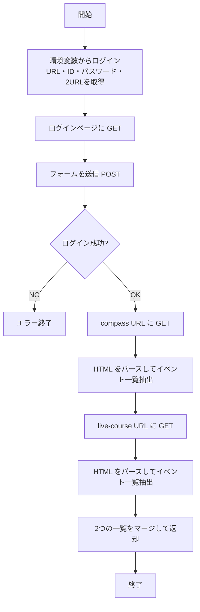
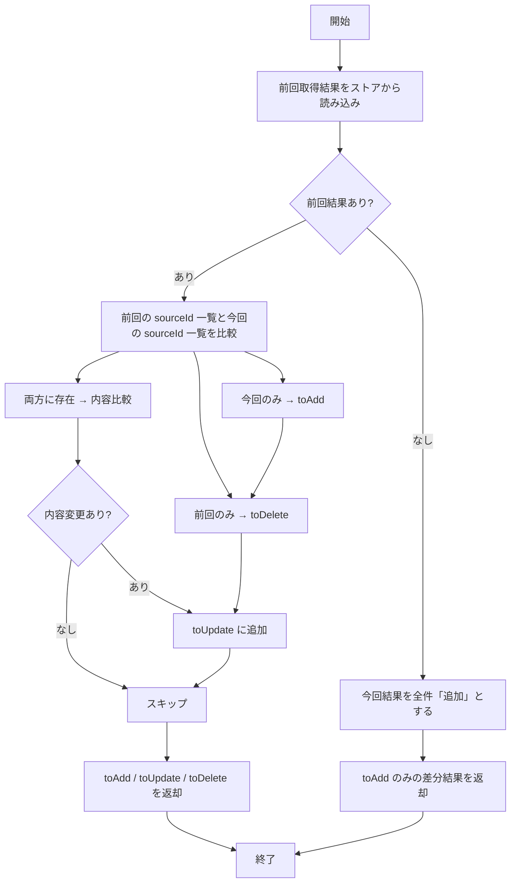
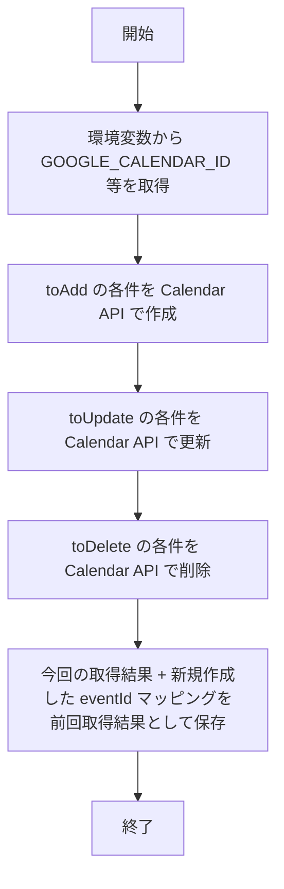

# 詳細設計書

**ベース**: [docs/03_基本設計書.md](03_基本設計書.md) で決まったジョブ・データを、**処理フロー・データ構造・エラー処理**まで落とし込んだ文書です。本システムは画面を持たないバッチのため、各処理の入出力・例外を定義します。

---

## 1. 対象処理の一覧

基本設計の JOB-01 〜 JOB-03 に対応する処理単位です。

| 処理ID | 処理名 | 概要 | 対応ジョブ |
|--------|--------|------|------------|
| F01 | 掲載スケジュール取得 | AiNA MyPage にログインし、compass / live-course の2URLからイベント一覧を取得・パースする | JOB-01 |
| F02 | 差分検知 | 今回取得結果と前回取得結果を比較し、追加・変更・削除のリストを生成する | JOB-02 |
| F03 | Google カレンダー反映 | 差分リストに従い、Google Calendar API でイベントの追加・更新・削除を行う。処理後に前回取得結果を今回の結果で上書き保存する | JOB-03 |

---

## 2. 共通データ構造

### 2.1 掲載スケジュール 1 件（取得結果の 1 要素）

AiNA MyPage から取得した 1 イベントを表す構造。パース仕様は実際の HTML に合わせて確定する。

| 項目名 | 型 | 必須 | 説明 |
|--------|-----|------|------|
| sourceId | 文字列 | ○ | サイト側で一意に識別できるID（URL のクエリ、data 属性等）。同一イベントの追加・変更・削除の判定に使用。 |
| title | 文字列 | ○ | イベント名・タイトル。 |
| startAt | 日時（ISO8601 等） | ○ | 開始日時。 |
| endAt | 日時（ISO8601 等） | 任意 | 終了日時。ない場合は開始と同一または要確認。 |
| url | 文字列 | 任意 | イベント詳細ページの URL。 |
| isFull | 真偽 | 任意 | 満員フラグ。true の場合、Google カレンダー側ではタイトルや説明に「満員」を付与する等（要確認）。 |
| source | 列挙 | ○ | 取得元の識別。**compass** または **live-course**。カレンダー登録時の「場所」「説明文」の有無の判定に使用。 |
| location | 文字列 | 条件付き | **場所**。**live-course のみ**パースして設定する。compass の場合は不要（空のまま）。Google カレンダー登録時も live-course のときだけ設定。 |
| instructor | 文字列 | 条件付き | **講師**。**live-course のみ**パースして設定する。compass では使用しない。説明文の組み立て用。 |
| notes | 文字列 | 条件付き | **備考**。**live-course のみ**パースして設定する。compass では使用しない。説明文の組み立て用。 |

**カレンダー登録用の「説明文」**: **講師** と **備考** を結合した文字列とする（例：`講師: ○○\n備考: △△` や、区切り文字は実装で決定）。**live-course** のイベントのみ説明文を Google カレンダーの `description` に設定する。**compass** のイベントは場所・説明文とも不要（空または API で送らない）。

**URL 別の扱い**

| 取得元（source） | 場所（location） | 説明文（description） |
|------------------|------------------|------------------------|
| **live-course** | 対象 URL の「場所」をパースして設定し、Google カレンダーにも登録する | 講師と備考を結合して設定し、Google カレンダーの説明文に登録する |
| **compass** | 不要。パースしない。カレンダーにも設定しない | 不要。パースしない。カレンダーにも設定しない |

※ 実際の HTML 構造が分かり次第、パースで取り出す項目（場所・講師・備考のセレクタ等）を確定する。

### 2.2 前回取得結果（ストアに保存する形式）

| 項目名 | 型 | 説明 |
|--------|-----|------|
| fetchedAt | 日時 | 取得した日時。 |
| events | 掲載スケジュールの配列 | 2.1 の配列。compass と live-course の両方を含む想定。 |
| (optional) googleEventIdMap | オブジェクト | sourceId → Google Calendar の eventId のマッピング。更新・削除時に API を呼ぶために使用。初回は空。 |

保存形式は JSON ファイルまたは DB の 1 レコード。保存先は環境変数または設定で指定（例：`STATE_FILE_PATH`、DB 接続情報）。

### 2.3 差分検知結果（F02 の出力）

| 項目名 | 型 | 説明 |
|--------|-----|------|
| toAdd | 掲載スケジュールの配列 | 新規追加するイベント。 |
| toUpdate | 配列 { sourceId, 掲載スケジュール1件 } | 変更されたイベント。既存の Google eventId で更新する。 |
| toDelete | 配列 { sourceId, googleEventId } | 削除するイベント。 |

---

## 3. 処理 F01：掲載スケジュール取得

### 3.1 処理フロー

| ステップ | 処理内容 |
|----------|----------|
| 環境変数取得 | AINA_LOGIN_URL, AINA_LOGIN_ID, AINA_LOGIN_PASSWORD, AINA_SCHEDULE_URL_COMPASS, AINA_SCHEDULE_URL_LIVE_COURSE。未設定の場合は起動時にエラー。 |
| ログイン | ログインページを GET し、フォーム（ID・パスワード）を POST。リダイレクト・Cookie を保持。セッション有効とみなす条件は要実装時確認（例：特定 URL へのリダイレクト、または 200 でログイン後ページの HTML が返る等）。 |
| 取得・パース | 認証済みセッションで compass / live-course を GET。返却 HTML をパースし、2.1 の構造の配列に変換。**compass** では title, startAt, endAt, sourceId, source 等を設定し、**場所・講師・備考はパースしない**。**live-course** では場所・講師・備考もパースして location, instructor, notes に設定する。パースルールは実際の HTML に依存するため、別ドキュメントまたはコード内コメントで定義。 |
| マージ | 2URL の結果を 1 つの配列にまとめる。各要素に source を付与（compass / live-course）しておく。sourceId の重複がある場合は方針を決める（例：compass 優先、または両方保持して source で区別）。 |

### 3.2 入出力

| 種別 | 内容 |
|------|------|
| 入力 | 環境変数（上記）。外部入力なし。 |
| 出力 | 掲載スケジュールの配列（2.1 の配列）。 |

### 3.3 エラー・例外

| 状況 | 動作 |
|------|------|
| 環境変数未設定 | 起動時または本処理開始時にエラーとし、ログに記録してジョブを終了。 |
| ログイン失敗（認証エラー・ネットワークエラー） | ログに記録し、ジョブを終了。リトライは現状スコープ外（要検討）。 |
| 取得 URL の GET 失敗（4xx/5xx、タイムアウト） | ログに記録し、ジョブを終了。 |
| パース失敗（HTML 構造変更等） | ログに記録し、ジョブを終了。部分的なパース結果は使わない。 |

---

## 4. 処理 F02：差分検知

### 4.1 処理フロー

| ステップ | 処理内容 |
|----------|----------|
| 前回結果読み込み | ストア（ファイル or DB）から前回取得結果を読み込む。存在しない場合は「初回」として扱う。 |
| 初回時 | 今回の取得結果をすべて toAdd とし、toUpdate / toDelete は空で返す。 |
| 2回目以降 | 前回の events と今回の events を sourceId をキーに比較。今回のみ → toAdd。前回のみ → toDelete（googleEventIdMap から eventId を取得）。両方に存在する場合は、タイトル・日時・isFull 等を比較し、変更があれば toUpdate に含める。 |
| 返却 | 2.3 の差分検知結果を返す。 |

### 4.2 入出力

| 種別 | 内容 |
|------|------|
| 入力 | 今回取得結果（2.1 の配列）。前回取得結果（2.2、ストアから読み込み）。 |
| 出力 | 差分検知結果（2.3）。 |

### 4.3 エラー・例外

| 状況 | 動作 |
|------|------|
| 前回結果の読み込み失敗（ファイル不存在は除く） | ログに記録し、ジョブを終了。ファイル不存在の場合は初回扱いで続行。 |
| 前回結果の JSON 破損等 | ログに記録し、初回扱いで全件 toAdd とするか、ジョブ終了とするか要検討。推奨：初回扱いで続行。 |

---

## 5. 処理 F03：Google カレンダー反映

### 5.1 処理フロー

| ステップ | 処理内容 |
|----------|----------|
| 認証 | Google Calendar API の認証（OAuth2 またはサービスアカウント）。トークン・鍵は環境変数または設定ファイルで管理。 |
| 追加 | toAdd の各イベントについて、Calendar API の events.insert を呼ぶ。**live-course** の場合は **location**（場所）と **description**（講師と備考を結合した説明文）をリクエストに含める。**compass** の場合は場所・説明文は含めない（空または省略）。返却された eventId を sourceId と対応付けてマッピングに保持。 |
| 更新 | toUpdate の各イベントについて、前回取得結果の googleEventIdMap から eventId を取得し、events.update を呼ぶ。同様に live-course は場所・説明文を渡し、compass は渡さない。満員の場合はタイトルや説明に「満員」を付与する等（要確認）。 |
| 削除 | toDelete の各イベントについて、googleEventId で events.delete を呼ぶ。 |
| 前回結果の保存 | 今回の取得結果（2.1 の配列）と、更新後の sourceId → googleEventId マッピングを 2.2 の形式でストアに上書き保存。 |

### 5.2 入出力

| 種別 | 内容 |
|------|------|
| 入力 | 差分検知結果（2.3）。前回取得結果（2.2、マッピング取得用）。 |
| 出力 | なし（副作用として Google カレンダー更新とストアへの保存）。 |

### 5.3 エラー・例外

| 状況 | 動作 |
|------|------|
| GOOGLE_CALENDAR_ID 未設定 | ログに記録し、ジョブを終了。 |
| Google API 認証失敗 | ログに記録し、ジョブを終了。 |
| events.insert / update / delete の一部失敗 | ログに記録。当該件はスキップして続行するか、ジョブ全体を終了するか要検討。推奨：当該件をログに残し、可能な範囲で続行。前回結果の保存は、成功した分だけマッピングを更新する等、一貫性に注意。 |
| 前回結果の保存失敗 | ログに記録し、次回実行時に差分がずれる可能性を許容するか、ジョブ終了とするか要検討。 |

---

## 6. 同期ジョブ全体のエラー・例外

| 状況 | 動作 |
|------|------|
| F01 失敗 | ジョブ終了。F02・F03 は実行しない。 |
| F02 失敗 | ジョブ終了。F03 は実行しない。 |
| F03 の一部失敗 | 上記 5.3 に従う。全体を止めるか、部分続行かは実装方針で決定。 |
| 想定外例外 | スタックトレースをログに記録し、ジョブを終了。必要に応じて通知（メール・Slack）を検討。 |

---

## 7. 他処理・項目の追加のしかた

- 新たに「取得 URL を 1 つ増やす」等の場合は、F01 のパース処理と 2.1 の source の扱いを拡張する。
- 前回取得結果の保存先を DB に変更する場合は、2.2 の形式を維持しつつ、読み書き層だけ差し替える。
- 「満員」の扱いが確定したら、2.1 の isFull と 5.1 の更新時のタイトル・説明のルールを追記する。

---

## 検討・提案メモ

- **詳細でまだ決まっていないこと**: 掲載スケジュールの実際の HTML 構造（パース仕様）、前回取得結果の保存先（ファイル path / DB）、満員時の Google カレンダー上の表示、F03 部分失敗時の方針（続行 vs 終了）、Google 認証方式（OAuth2 ユーザー認証 vs サービスアカウント）。
- **リスク・代替案**: AiNA の HTML 変更で F01 のパースが壊れる。選択肢は「正規表現やセレクタの保守」「可能なら API 問い合わせ」。
- **より良い案**: パース仕様を HTML サンプル付きで別ドキュメント化する。リトライ（指数バックオフ）を F01 に導入する。F03 でバッチリクエストが使えれば API 呼び出し回数を削減できる。
